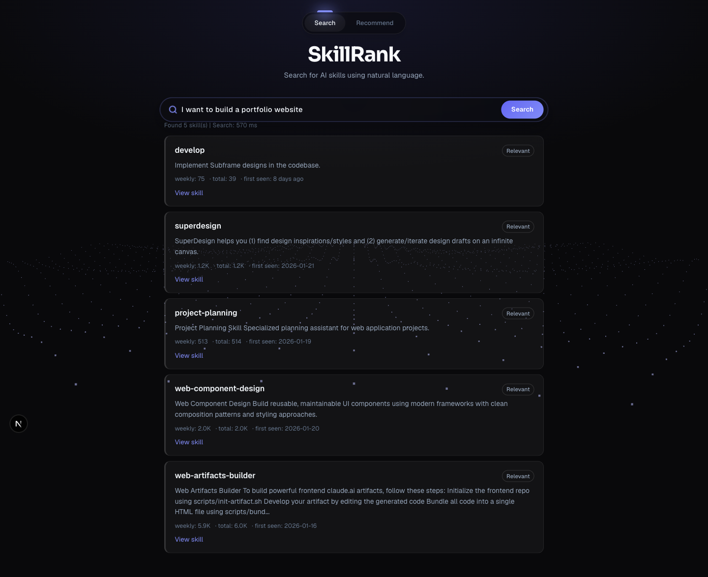
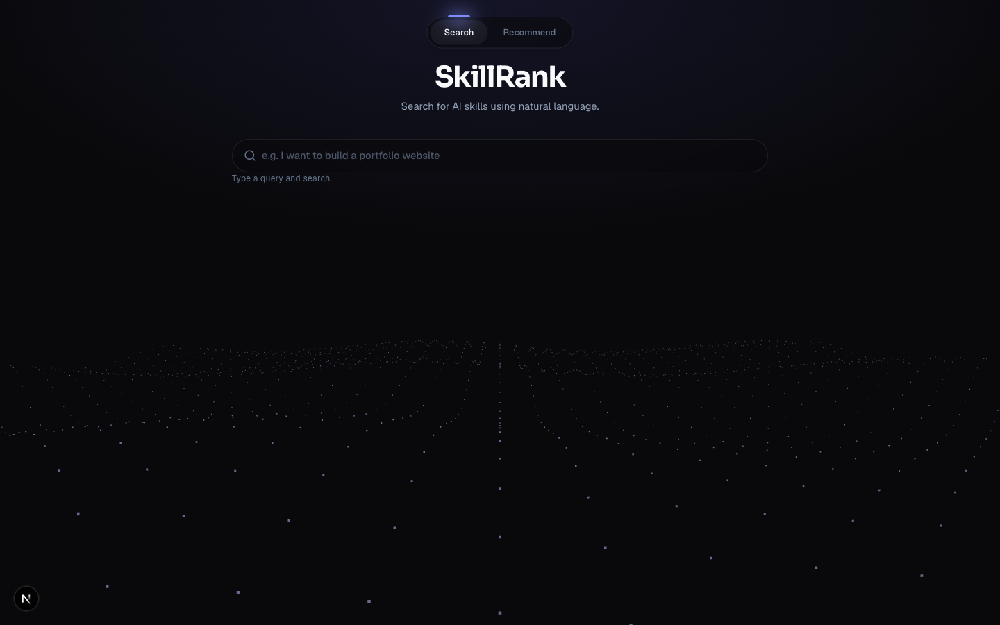
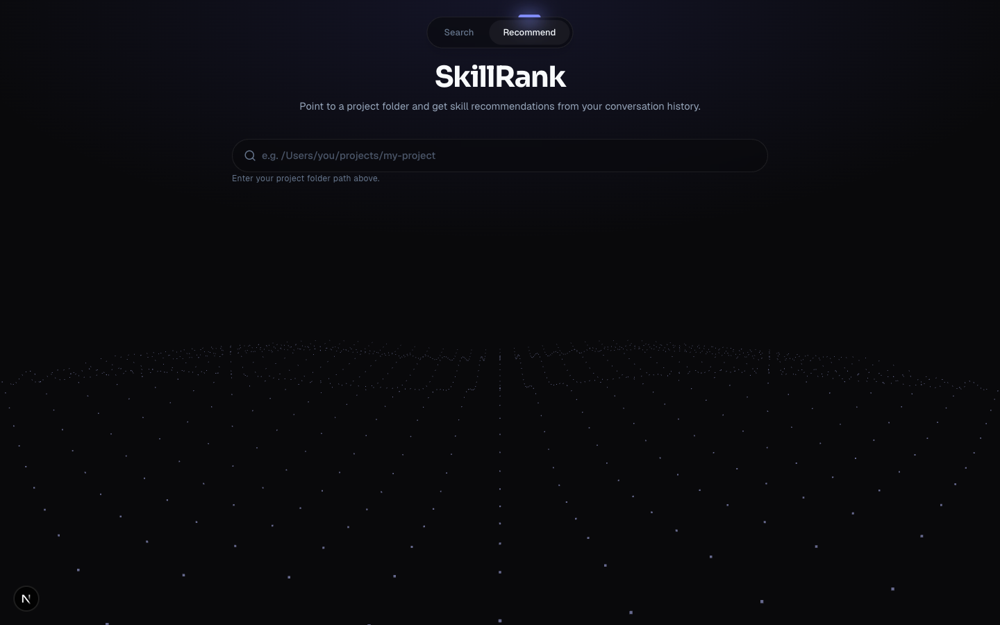
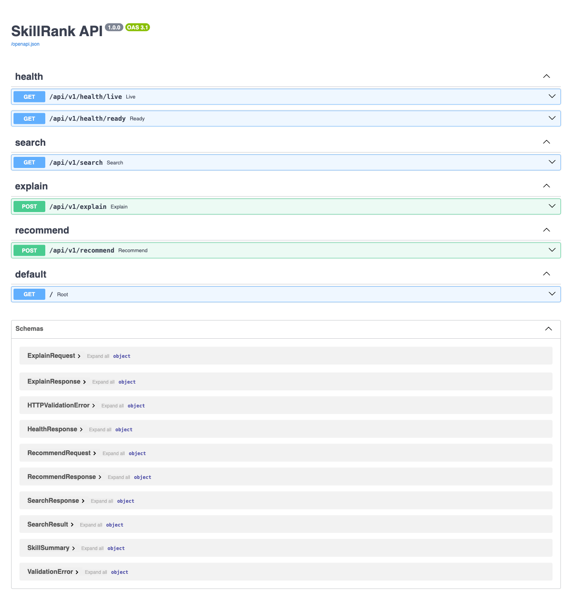
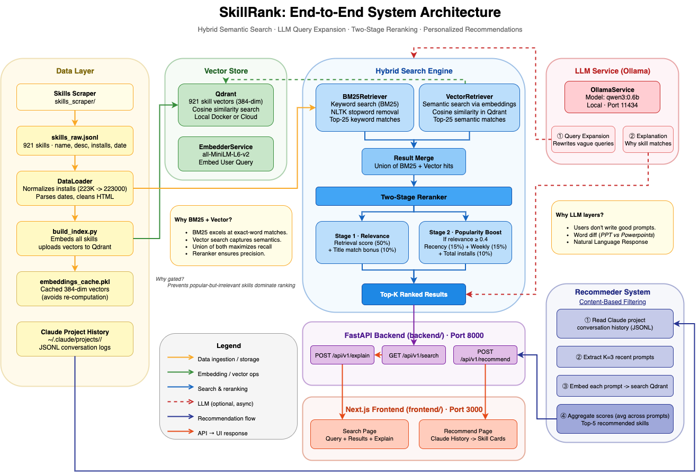

<div align="center">

# 🔎 SkillRank

### Natural-language search & recommendation engine for AI agent skills

Type what you want to build — *"I want to build a portfolio website"* — and SkillRank returns
the most relevant skills from the [skills.sh](https://skills.sh) ecosystem, ranked by a blend of
**semantic meaning** and **popularity**.


*Final project for INFO376 — Search & Recommender Systems*

📄 **[Read the full technical report →](docs/SkillRank-Report.pdf)**

</div>

---

<div align="center">

### Search by meaning, not keywords



</div>

---

## 🎯 Why SkillRank?

Finding the right AI skill usually means already knowing its exact name — traditional search and
category browsing reward tools you've *already* heard of and hide better matches. But people describe
what they want in plain language ("summarize long PDFs", "extract tables from research papers"), which
keyword search can't match. SkillRank bridges that gap with three goals:

1. **Hybrid retrieval** combining lexical (BM25) and dense semantic search — capturing both exact
   technical terms and paraphrased intent.
2. **Relevance-first reranking** that applies popularity and recency only *after* a candidate clears a
   relevance bar, so niche-but-perfect skills aren't buried by popular ones.
3. **An end-to-end system** — data pipeline, retrieval, reranking, and a clean interface.

## ✨ Highlights

- **Semantic search** — understands *intent*, so "make my site load faster" can find "Next.js
  image optimization" with zero shared keywords.
- **Hybrid retrieval** — combines classic **BM25** keyword matching with **vector similarity**,
  then a **two-stage reranker** that layers in recency and install popularity.
- **LLM query expansion** — a local LLM rewrites casual queries into richer technical terms before
  searching, with a graceful fallback when it's unavailable.
- **Conversation-based recommendations** — point it at a project folder and it suggests skills based
  on what you've recently been working on.
- **Measured, not guessed** — a full **evaluation harness** (Precision@K, MRR, NDCG@3) with a
  regression gate, plus an honest error analysis.

## 📸 Screenshots

| Search | Recommend |
|:------:|:---------:|
|  |  |
| *Natural-language search with a live results feed* | *Skill recommendations from your project history* |

<div align="center">

**Auto-generated OpenAPI docs** (FastAPI `/docs`)



</div>

---

## 🏗️ Architecture



**The pipeline in one line:**
`scrape → clean → embed → index → (expand query) → search by meaning → rerank → explain → show`

## ⚙️ How It Works

1. **Data collection** — a Scrapy spider crawls skills.sh (top / trending / hot + each skill page)
   and extracts name, description, docs, weekly/total installs, first-seen date, and GitHub URL for
   **~981 skills**.
2. **Cleaning & indexing** — install counts (`"4.2K"` → `4200`) and dates are normalized and HTML is
   stripped. Each skill's name + description is embedded with **`all-MiniLM-L6-v2`** into a **384-dim**
   vector and stored in **Qdrant**.
3. **Query expansion** — the user's query is rewritten by a local **Ollama** LLM (`qwen3:0.6b`) into
   richer technical terms (e.g. *"build a portfolio website"* → React, Next.js, Tailwind, deployment).
   Falls back to the raw query if Ollama is offline.
4. **Semantic search** — the expanded query is embedded with the same model and matched against Qdrant
   by **cosine similarity** — closeness in *meaning*, regardless of exact words.
5. **Result explanation** — the frontend asks the LLM for a one-line "why this matches" per result.
6. **Recommendations** — an alternate mode reads recent prompts from local Claude Code history, embeds
   them, and averages the scores to recommend skills based on what you've been working on.

> The repo also ships a standalone **hybrid engine** (`search/`) — **BM25 + vector + a tunable
> two-stage reranker** — exposed via CLI and a Flask UI, used for offline experimentation.

## 🧰 Tech Stack

| Layer | Technology |
|-------|------------|
| Data collection | Python, **Scrapy** |
| Backend API | Python, **FastAPI**, Uvicorn, Pydantic |
| Vector database | **Qdrant** (local Docker or Qdrant Cloud) |
| Embeddings | **sentence-transformers** (`all-MiniLM-L6-v2`, 384-dim) |
| Query expansion | **Ollama** (`qwen3:0.6b`, local) |
| Frontend | **Next.js 16**, React 19, TypeScript, Tailwind CSS 4, Framer Motion, Three.js |
| Testing | pytest (backend), ESLint (frontend) |

## 📊 Evaluation

The system is evaluated on **10 natural-language queries** with graded relevance, using an automated
harness (`test_cases/eval_harness.py`) that hits the live backend and computes standard IR metrics.

| Metric | Score |
|--------|-------|
| Precision@1 | **0.50** |
| **Precision@3** | **0.47** |
| MRR | **0.63** |
| NDCG@3 | **0.50** |
| vs. random baseline | **~157× better** (0.47 vs. 0.003) |

> **The ground-truth story.** Our first pass scored P@3 = 0.20 — but before trusting it we checked
> whether the hand-written "correct answers" actually existed in the index and found **only 7 of 30
> did**. The system was being penalized for not returning skills that were never scraped. After
> re-grounding each query to real skills, the corrected **P@3 rose to 0.47** — separating *search
> quality* from *data-coverage gaps*. Full methodology, per-query results, and error analysis are in
> [`docs/EVALUATION_REPORT.md`](docs/EVALUATION_REPORT.md).

**Representative per-query results** (validated 20-query set):

| Query | P@3 | MRR | NDCG@3 |
|-------|:---:|:---:|:------:|
| React Native + Expo | 1.00 | 1.00 | 0.84 |
| Blog post + SEO | 1.00 | 1.00 | 0.88 |
| Design system | 0.67 | 1.00 | 0.87 |
| Figma wireframes | 0.67 | 1.00 | 0.80 |
| iOS + Firebase | 0.33 | 0.33 | 0.32 |
| GitHub triage\* | 0.00 | 0.00 | 0.00 |
| **Average** | **0.47** | **0.63** | **0.50** |

<sub>\*GitHub triage fails because the matching skill has an empty description — a data-quality gap, not a ranking error.</sub>

The harness fails (non-zero exit) if mean P@3 drops below **0.15** — a CI-style regression gate.

## ⚖️ Trade-offs & Limitations

**Design trade-offs**
- **Local LLM over hosted** — query expansion runs on a small local Ollama model: zero API cost and
  full privacy, at the price of less precise rewrites than a larger hosted model.
- **Hybrid over single-method retrieval** — combining BM25 + dense vectors improves robustness across
  query styles, at the cost of added complexity, storage, and latency.
- **Relevance gated before popularity** — install/recency signals only boost candidates that already
  clear a relevance threshold, so niche-but-relevant skills aren't buried by popular ones.

**Known limitations**
- Retrieval quality depends heavily on the **textual quality of the corpus** — sparse or missing skill
  descriptions hurt both lexical and semantic matching.
- Fusion and reranking weights are **hand-tuned, not learned**.
- Authority signals (installs, recency) are **proxies** for quality, not ground truth.
- The **20-query benchmark** is directional; larger interaction logs / a user study are future work.

> Full problem framing, system design, and analysis are documented in the team's NeurIPS-style
> technical report.

---

## 🚀 Getting Started

### Prerequisites

| Tool | Version | Notes |
|------|---------|-------|
| Python | 3.10 – 3.12 | 3.13+ not supported by PyTorch |
| Node.js | 18+ | For the frontend |
| Docker | Any | For running Qdrant locally (or use Qdrant Cloud) |
| Ollama | Latest | Optional — query expansion & explanations |

### 1. Clone & scrape

```bash
git clone https://github.com/rpushkar9/SkillRank.git
cd SkillRank
# The dataset (skills_scraper/data/skills_raw.jsonl) is already included.
# To re-scrape:  cd skills_scraper && pip install scrapy && scrapy crawl skills
```

### 2. Set up the backend

```bash
cd backend
python3 -m venv .venv && source .venv/bin/activate
pip install -r requirements.txt
cp .env.example .env
```

Start Qdrant (local Docker):

```bash
docker run -d --name skillrank-qdrant -p 6333:6333 -p 6334:6334 qdrant/qdrant
```

*(Or set `QDRANT_URL` + `QDRANT_API_KEY` in `.env` to use Qdrant Cloud.)*

### 3. Build the vector index

```bash
python scripts/build_index.py --recreate
python scripts/verify_index.py --query "react testing" --limit 5   # sanity check
```

### 4. Run backend + frontend

```bash
# Terminal 1 — backend
uvicorn app.main:app --reload --port 8000        # docs at http://127.0.0.1:8000/docs

# Terminal 2 — frontend
cd ../frontend && npm install
cp .env.local.example .env.local                 # first time only
npm run dev                                       # http://localhost:3000
```

Optional — enable query expansion & explanations:

```bash
ollama pull qwen3:0.6b && ollama serve
```

## 📡 API Reference

| Method | Endpoint | Description |
|--------|----------|-------------|
| `GET` | `/api/v1/search?q=<query>&k=<limit>` | Search skills by query. `q` required; `k` defaults to 5 (max 20). |
| `POST` | `/api/v1/explain` | Per-skill explanations. Body: `{ "query": "...", "skills": [...] }` |
| `POST` | `/api/v1/recommend` | Recommend skills from Claude conversation history. Body: `{ "folder_path": "..." }` |
| `GET` | `/api/v1/health/live` | Liveness probe. |
| `GET` | `/api/v1/health/ready` | Readiness probe (Qdrant + embedder). |

<details>
<summary><b>Example search response</b></summary>

```json
{
  "query": "react testing",
  "total": 3,
  "results": [
    {
      "skill_id": "skill-000354",
      "name": "typescript-react-reviewer",
      "description": "TypeScript + React 19 Code Review Expert...",
      "skill_url": "https://github.com/...",
      "weekly_installs": 399,
      "total_installs": 263,
      "first_seen": "2026-01-21",
      "score": 0.5186
    }
  ],
  "took_ms": 42.15,
  "expanded_query": "React component testing, unit tests, Vitest, Jest...",
  "expand_ms": 320.5
}
```
</details>

## 🧪 Running Tests

```bash
# Backend
cd backend && source .venv/bin/activate && python -m pytest tests/ -v

# Frontend
cd frontend && npm run lint

# End-to-end evaluation (backend + Qdrant must be running)
python test_cases/eval_harness.py --top-k 5 --base-url http://localhost:8000
```

## 📁 Project Structure

```
SkillRank/
├── skills_scraper/   # Scrapy spider + scraped dataset (skills_raw.jsonl)
├── backend/          # FastAPI app: services, api/v1 endpoints, schemas, scripts, tests
├── frontend/         # Next.js 16 app: search + recommend pages, API clients
├── search/           # Standalone hybrid engine: BM25 + vector + two-stage reranker (CLI/Flask)
├── test_cases/       # Evaluation: ground truth, eval harness, scenarios
└── docs/             # Evaluation report, devlog, run guide, screenshots
```

## 🔧 Environment Variables

<details>
<summary><b>Backend (<code>backend/.env</code>)</b></summary>

| Variable | Default | Description |
|----------|---------|-------------|
| `QDRANT_URL` | *(empty)* | Qdrant Cloud endpoint. Empty → local Docker. |
| `QDRANT_API_KEY` | *(empty)* | Qdrant Cloud API key. |
| `QDRANT_HOST` / `QDRANT_PORT` | `localhost` / `6333` | Local Qdrant connection. |
| `QDRANT_COLLECTION` | `skills` | Collection name. |
| `EMBED_MODEL` / `EMBED_DIM` | `all-MiniLM-L6-v2` / `384` | Embedding model + dimension. |
| `DEFAULT_TOP_K` / `MAX_TOP_K` | `5` / `20` | Result count defaults + cap. |
| `OLLAMA_BASE_URL` / `OLLAMA_MODEL` | `localhost:11434` / `qwen3:0.6b` | Query-expansion LLM. |
| `OLLAMA_ENABLED` | `true` | Set `false` to disable query expansion. |
| `CORS_ALLOW_ORIGINS` | `localhost:3000,127.0.0.1:3000` | Allowed origins. |

</details>

<details>
<summary><b>Frontend (<code>frontend/.env.local</code>)</b></summary>

| Variable | Default | Description |
|----------|---------|-------------|
| `NEXT_PUBLIC_API_BASE_URL` | `http://127.0.0.1:8000` | Backend API URL. |

</details>

## 🩺 Troubleshooting

| Problem | Solution |
|---------|----------|
| `Collection does not exist` | Run `python scripts/build_index.py --recreate`. |
| `Connection refused` on startup | Qdrant unreachable — check `QDRANT_URL` or start the Docker container. |
| Frontend "Search request failed" | Backend down, or wrong `NEXT_PUBLIC_API_BASE_URL`. |
| Slow first query | The embedding model loads into memory on first request; later queries are fast. |
| PyTorch / NumPy conflict | Use Python 3.10–3.12; `pip install "numpy<2.0.0"` if needed. |

## 📚 References

- Robertson & Zaragoza (2009). *The Probabilistic Relevance Framework: BM25 and Beyond.*
- Reimers & Gurevych (2019). *Sentence-BERT.* [arXiv:1908.10084](https://arxiv.org/abs/1908.10084)
- [Qdrant docs](https://qdrant.tech/documentation/) · [Ollama](https://ollama.com) · [skills.sh](https://skills.sh)

## 📄 License

University project for INFO376 (Search & Recommender Systems).
